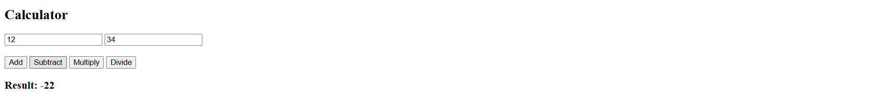
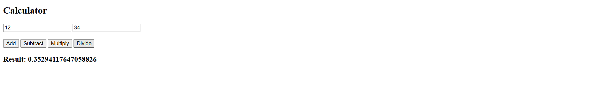

# Simple Calculator

A basic calculator built using HTML and JavaScript. This project performs simple arithmetic operations on two numbers.

## Features

- Addition
- Subtraction
- Multiplication
- Division
- User-friendly interface
- Instant result display

## Technologies Used

- HTML
- JavaScript

## How to Run

1. Download or clone the repository.
2. Open `index.html` in any web browser.
3. Enter two numbers.
4. Click on any operation button.
5. View the result instantly.

## Project Structure

```
Simple-Calculator/
│
├── index.html
└── README.md
```

## Screenshots







## Author
Harshita Chuphal

GitHub: https://github.com/harshitachuphal

LinkedIn: https://www.linkedin.com/in/harshita-chuphal-3a2453326

LeetCode: https://leetcode.com/u/harshitachuphal_12/

